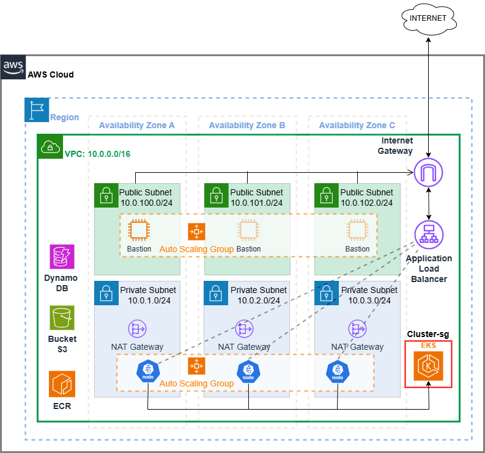

# **Empresa e-shop Services - Migración desde On-Premise a Cloud**

---

## **Descripción del Proyecto**
La startup **“e-shop Services”** está expandiendo su operación de e-commerce y retail a todo el continente de América. Para lograrlo, se ha contratado a la consultora **BitBeat** para modernizar y desplegar la infraestructura de su aplicación en la nube AWS.
El proyecto implica la migración de una arquitectura monolítica, actualmente en un datacenter on-premise, hacia un entorno basado en **microservicios** desplegados en **contenedores** utilizando tecnologías como **Docker**, **Kubernetes**, y servicios administrados en la nube.

---

## **Objetivo**

Desplegar los microservicios necesarios, en un entorno basado en contenedores, garantizando su disponibilidad, escalabilidad y rendimiento para soportar la operación a nivel continental.

---

## **Arquitectura General**
La aplicación cuenta con **12 microservicios** que interactúan entre sí mediante APIs y servicios específicos. Cada uno de estos se empaquetará como un contenedor y se desplegará en la nube.

--

## **Estructura del Proyecto**

---

## **Diagrama de Infraestructura**

### **Carpetas y Archivos Principales**

Contiene el código fuente de los microservicios. Cada subdirectorio corresponde a un microservicio independiente:

---
### **Microservicios Desplegados**
#### **`src/`**
- `adservice/`: Servicio de publicidad.
- `cartservice/`: Servicio de carrito de compras.
- `checkoutservice/`: Gestión del proceso de checkout.
- `currencyservice/`: Conversión y manejo de monedas.
- `emailservice/`: Envío de notificaciones por correo electrónico.
- `frontend/`: Interfaz gráfica para los usuarios finales.
- `loadgenerator/`: Generador de carga para pruebas de rendimiento.
- `paymentservice/`: Integración de métodos de pago.
- `productcatalogservice/`: Gestión del catálogo de productos.
- `recommendationservice/`: Servicio de recomendaciones personalizadas
- `redis/`: Servicio de almacenamiento en memoria y caché.
- `shippingservice/`: Gestión de envíos y logística.

---

## **Servicios de AWS Usados**

1. **Amazon VPC:** Administra las redes y subredes utilizadas por la infraestructura.
2. **AWS ECR:** Almacena imágenes de Docker.
3. **AWS EKS:** Orquesta contenedores con Kubernetes.
4. **Amazon S3:** Almacena el estado remoto de Terraform.
5. **Amazon DynamoDB:** Bloquea el estado remoto de Terraform.
6. **Amazon EC2:** Proporciona la instancia para el runner privado.
7. **ALB:** Puerta de entrada desde internet al cluster, distribuye la carga entre los nodos.
8. **Internet Gateway:** Entrada y salida de las subnets publicas
9. **NAT Gateway:** Permite salida a internet desde la subnet privada

---

## **Datos de la Infraestructura**

- **Instancias EC2:**
  - Tipo: `t3.micro` (runner privado) y `t3.medium` (nodos EKS).
- **Bloques CIDR:**
  - VPC: `10.0.0.0/16`.
  - Subredes privadas: `10.0.1.0/24`, `10.0.2.0/24`, `10.0.3.0/24`.
  - Subredes públicas: `10.0.100.0/24`, `10.0.101.0/24`, `10.0.102.0/24`.
- **Reglas de Firewall:**
  - Ingreso en los puertos `443` (HTTPS) y `22` (SSH).

---
### **Módulos Implementados**

#### **`modules/`**

#### **`vpc`**
- **Funcionalidad:** Crea una VPC con subredes públicas y privadas, tablas de enrutamiento y NAT Gateway.
- **Parámetros Clave:**
  - `vpc_cidr`: Rango CIDR de la VPC.
  - `public_subnet_cidrs`: Rango CIDR para subredes públicas.
  - `private_subnet_cidrs`: Rango CIDR para subredes privadas.
- **Outputs:**
  - Subnets creadas, tabla de enrutamiento y NAT Gateway.

#### **`ecr`**
- **Funcionalidad:** Crea registros de contenedores en AWS Elastic Container Registry.
- **Output:** Devuelve la URL del registro para el inicio de sesión (`docker login`).

#### **`eks`**
- **Funcionalidad:** Configura un clúster de Kubernetes con AWS Elastic Kubernetes Service.
- **Detalles Clave:**
  - Crea nodos gestionados y roles IAM asociados.
  - Instala complementos como `CoreDNS`.

#### **`docker`**
- **Funcionalidad:** Administra imágenes de contenedores y despliegues en AWS ECR.
Incluye módulos reutilizables para la configuración y despliegue de la infraestructura con **Terraform**:
- `iam.tf`: Configuración de políticas y roles de IAM.
- `main.tf`: Archivo principal de configuración de recursos en la nube.
- `outputs.tf`: Salidas del estado final del despliegue.
- `provider.tf`: Configuración del proveedor de infraestructura (AWS).
- `variables.tf`: Definición de las variables utilizadas en el proyecto.
- 

#### **Otros Archivos Importantes**
- **`terraform/`**: Contiene la configuración completa para desplegar la infraestructura en la nube.
- **`Makefile`**: Comandos de automatización para tareas comunes.
- **`README.md`**: Documentación principal del proyecto.
- **`LICENSE`**: Información sobre la licencia del proyecto.

### **Decisiones Clave**
1. **Separación de `ecr`:**
   - Para realizar el `docker login`, fue necesario ejecutar el módulo `ecr` primero, antes del despliegue de la infraestructura principal.

2. **Gestión del Estado con S3 y DynamoDB:**
   - Se configuran automáticamente un bucket S3 y una tabla DynamoDB para almacenar el estado remoto de Terraform. Esto es crítico porque los runners de GitHub Actions no son persistentes.

---

## **Requisitos Previos**
Antes de comenzar, asegúrate de cumplir con los siguientes requisitos:
- Tener instalado **Terraform**.
- Disponer de una cuenta de AWS con permisos adecuados.
- Instalar **Docker** y/o **Kubernetes** para ejecutar contenedores localmente (opcional).

---

## **Instalación y Configuración**

## **Estrategia de Git**

Se adopta la metodología **Trunk-Based Development**, la cual organiza el flujo de trabajo de la siguiente manera:

- **`main`:** Es la rama de desarrollo principal. Todas las nuevas funcionalidades (features) derivan de esta rama.
- **`feature/*`:** Ramas temporales para desarrollar características específicas o solucionar problemas. Una vez finalizado el desarrollo, estas ramas se fusionan en `main`.
- **`test`:** Es la rama de pruebas donde se activa el pipeline CI/CD para realizar validaciones y pruebas antes de desplegar cambios en el ambiente de producción.

### **Por qué Trunk-Based Development**
- Promueve la integración continua al limitar la existencia de ramas a corto plazo.
- Minimiza los conflictos de código.
- Facilita los despliegues frecuentes y permite mantener una base de código siempre lista para producción.

---
## **Instructivo de Uso del Repositorio**

Este repositorio implementa un proyecto basado en infraestructura como código (**IaC**) utilizando **Terraform** y **GitHub Actions** para automatizar el proceso de CI/CD en AWS. Contiene configuraciones y módulos reutilizables que permiten el despliegue de una arquitectura robusta y escalable.

### **Cómo Usar el Repositorio**

1. **Clonar el repositorio:**
   
   git clone https://github.com/vladimirdemari/Obligatorio-Soluciones-Cloud.git
   cd Obligatorio-Soluciones-Cloud
   

2. **Revisar las ramas disponibles:**
   
   git branch -a
  
   - `main`: Rama de desarrollo principal.
   - `test`: Rama de pruebas que activa el workflow CI/CD.
   - `feature/*`: Ramas temporales para desarrollar nuevas funcionalidades.

3. **Configurar las credenciales de AWS:**
   - Crear un archivo `~/.aws/credentials` con las credenciales de tu cuenta de AWS Academy o de tu cuenta personal:
    
     [default]
     aws_access_key_id=YOUR_ACCESS_KEY_ID
     aws_secret_access_key=YOUR_SECRET_ACCESS_KEY
     aws_session_token=YOUR_SESSION_TOKEN
    

4. **Ejecutar el workflow manualmente:**
   Desde la interfaz de GitHub, puedes ejecutar manualmente el workflow para probar despliegues.
   
   ## **Workflow de GitHub Actions**

---

### **Desplegar la Infraestructura**

## **Arquitectura y Estructura de Terraform**

El proyecto utiliza **Terraform** con un enfoque modular para maximizar la reutilización del código y garantizar escalabilidad. 

### **Estructura General**
1. **Nivel Global (`main.tf`):**
   - Define los parámetros principales de la infraestructura.
   - Administra las conexiones entre módulos reutilizables y centraliza las variables globales.
   - Maneja flujos de entrada y salida para alimentar otros recursos.

2. **Módulos Personalizados (`modules/`):**
   - Cada módulo encapsula recursos específicos de AWS para ser reutilizables en múltiples proyectos.
   - Reciben variables desde `main.tf` y generan **outputs** para alimentar otros procesos.
Desplegar la infraestructura en la nube utilizando Terraform:

Navega al directorio de configuración de Terraform:

- `cd terraform`:
Inicializa el backend de Terraform:

- `terraform init`:
Planifica el despliegue para verificar qué recursos se crearán:

- `terraform fmt`:
Facilita la lectura y mantenimiento del código

- `terraform validate`:
Verifica que los archivos de configuración de Terraform sean válidos sintáctica y estructuralmente.

- `terraform plan`:
Aplica el plan para desplegar la infraestructura:

- `terraform apply`:
Ejecuta el plan de Terraform y aplica los cambios especificados para crear, actualizar o eliminar recursos en la infraestructura.

### **Pipeline CI/CD**

El workflow automatiza el despliegue completo de la infraestructura y está compuesto por las siguientes etapas:

1. **Configuración del Backend:**
   - Verifica si existen el bucket S3 y la tabla DynamoDB. Si no están presentes, se crean automáticamente.

2. **Creación del Registro ECR:**
   - Ejecuta el módulo `ecr` para crear los registros de contenedores y devolver la URL como output.

3. **Despliegue Principal:**
   - Ejecuta el archivo global `main.tf`, que incluye la configuración de la VPC, EKS, y otros recursos.

4. **Creación de un Runner Privado:**
   - Lanza una instancia EC2 en una subred privada para actuar como un runner autoservicio que interactúa con el clúster Kubernetes.

### **Pasos para contribuir con el proyecto:**

Haz un fork del repositorio.
Crea una rama para tus cambios:

- `git checkout -b feature/nueva-funcionalidad`:

Realiza un commit con tus cambios:

- `git commit -m "Agrega nueva funcionalidad"`:

Haz push a tu rama:

- `git push origin feature/nueva-funcionalidad"`:

Crea un Pull Request en GitHub.

## Conclusión

Este proyecto demuestra el proceso utilizado por nosotros para migrar una infraestructura on-premise a AWS utilizando Terraform para automatizar el proceso. La solución mejora la escalabilidad y nos probee mas oportunidades de contingencia para el sitio web, esto nos permite asegurar niveles mas altos de producción.

Para más información, consulta la documentación incluida en el repositorio.

## Recursos

[Terraform - AWS](https://registry.terraform.io/providers/hashicorp/aws/latest/docs)

IA - ChatGPT

## Proyecto creado por los alumnos

© 2024 Vladimir Demari - 291649 & Sebastián Rodríguez - 166526
